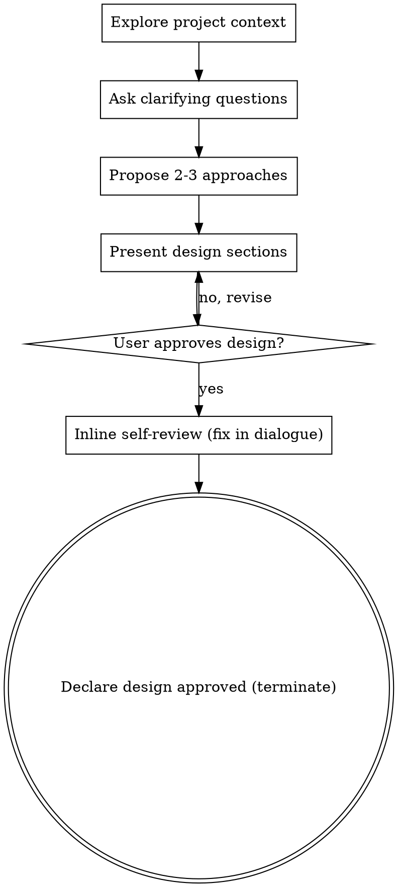

# Brainstorming Ideas Into Designs (ohaze)

Help turn ideas into fully formed designs through natural collaborative dialogue. **This fork terminates at user-approved design.** It does not write a spec file and does not invoke writing-plans. In the ohaze ship flow, the design is written to a spec file in `/ohaze:ship` Phase 2 — *after* a worktree exists — so the spec commit lands on the feature branch and `main` stays untouched.

Start by understanding the current project context, then ask questions one at a time to refine the idea. Once you understand what you're building, present the design and get user approval. **Stop there.**

<HARD-GATE>
Do NOT invoke any implementation skill, write any code, scaffold any project, or take any implementation action until you have presented a design and the user has approved it. This applies to EVERY project regardless of perceived simplicity.
</HARD-GATE>

## Anti-Pattern: "This Is Too Simple To Need A Design"

Every project goes through this process. A todo list, a single-function utility, a config change — all of them. "Simple" projects are where unexamined assumptions cause the most wasted work. The design can be short (a few sentences for truly simple projects), but you MUST present it and get approval.

## Checklist

You MUST create a task for each of these items and complete them in order:

1. **Explore project context** — check files, docs, recent commits
2. **Ask clarifying questions** — one at a time, understand purpose/constraints/success criteria
3. **Propose 2-3 approaches** — with trade-offs and your recommendation
4. **Present design** — in sections scaled to their complexity, get user approval after each section
5. **Design self-review (inline, conversational)** — quick check for placeholders, contradictions, ambiguity, scope; fix inline before declaring "design approved"
6. **Declare terminal state** — confirm "design approved" to the user and stop. Do NOT write a spec file. Do NOT invoke writing-plans. The caller (`/ohaze:ship` Phase 2) handles those.

## Process Flow

**The terminal state is "design approved" — nothing more.** Do NOT write to `docs/superpowers/specs/`. Do NOT invoke `ohaze:writing-plans` or `superpowers:writing-plans` or `frontend-design` or any other implementation skill. The ONLY thing you do after design approval is hand control back to the caller.

## The Process

**Understanding the idea:**

- Check out the current project state first (files, docs, recent commits)
- Before asking detailed questions, assess scope: if the request describes multiple independent subsystems (e.g., "build a platform with chat, file storage, billing, and analytics"), flag this immediately. Don't spend questions refining details of a project that needs to be decomposed first.
- If the project is too large for a single spec, help the user decompose into sub-projects: what are the independent pieces, how do they relate, what order should they be built? Each sub-project gets its own brainstorm → spec → plan → implementation cycle.
- For appropriately-scoped projects, ask questions one at a time to refine the idea
- Prefer multiple choice questions when possible, but open-ended is fine too
- Only one question per message — if a topic needs more exploration, break it into multiple questions
- Focus on understanding: purpose, constraints, success criteria

**Exploring approaches:**

- Propose 2-3 different approaches with trade-offs
- Present options conversationally with your recommendation and reasoning
- Lead with your recommended option and explain why

**Presenting the design:**

- Once you believe you understand what you're building, present the design
- Scale each section to its complexity: a few sentences if straightforward, up to 200-300 words if nuanced
- Ask after each section whether it looks right so far
- Cover: architecture, components, data flow, error handling, testing
- Be ready to go back and clarify if something doesn't make sense

**Design for isolation and clarity:**

- Break the system into smaller units that each have one clear purpose, communicate through well-defined interfaces, and can be understood and tested independently
- For each unit, you should be able to answer: what does it do, how do you use it, and what does it depend on?
- Can someone understand what a unit does without reading its internals? Can you change the internals without breaking consumers? If not, the boundaries need work.
- Smaller, well-bounded units are also easier to work with — you reason better about code you can hold in context at once, and your edits are more reliable when files are focused. When a file grows large, that's often a signal that it's doing too much.

**Working in existing codebases:**

- Explore the current structure before proposing changes. Follow existing patterns.
- Where existing code has problems that affect the work (e.g., a file that's grown too large, unclear boundaries, tangled responsibilities), include targeted improvements as part of the design — the way a good developer improves code they're working in.
- Don't propose unrelated refactoring. Stay focused on what serves the current goal.

## After the Design (terminate cleanly)

**Inline self-review** (in the same conversation, not a file):

After the user approves the design, do a quick fresh-eyes pass on the agreed design and fix anything ambiguous in dialogue before declaring terminal:

1. **Placeholder scan:** Any "TBD", "TODO", incomplete sections, or vague requirements? Clarify with one more question.
2. **Internal consistency:** Do any sections contradict each other? Does the architecture match the feature descriptions?
3. **Scope check:** Is this focused enough for a single implementation plan, or does it need decomposition?
4. **Ambiguity check:** Could any requirement be interpreted two different ways? If so, pick one with the user and make it explicit.

Fix any issues in conversation. Do not write a separate review file.

**Terminate cleanly:**

> "Design approved. Handing back to /ohaze:ship Phase 2 — it will set up the worktree and write this design to a spec file inside the worktree."

**This "Handing back" is a return-from-subroutine signal, NOT an end-of-turn signal.** Your very next action in the SAME assistant turn MUST be the Phase 2a `Skill(ohaze:using-git-worktrees)` invocation from `/ohaze:ship`. Do NOT end the turn. Do NOT wait for the user to type anything (they have nothing to type — they already approved). If you find yourself stopping after the "Design approved" line, you are misreading the protocol — this skill returns control to the orchestrator, it does not yield the turn to the user.

The caller (`/ohaze:ship`) will then:
- Create the worktree (`ohaze:using-git-worktrees`)
- Write the approved design to `docs/superpowers/specs/<date>-<slug>-design.md` and commit it on the feature branch
- Invoke `ohaze:writing-plans` to produce the implementation plan

You do not perform any of those steps. **Do not write the spec file. Do not invoke writing-plans.** But you DO immediately proceed to Phase 2a in the same turn — that is the whole point of "handing back."

## Key Principles

- **One question at a time** — Don't overwhelm with multiple questions
- **Multiple choice preferred** — Easier to answer than open-ended when possible
- **YAGNI ruthlessly** — Remove unnecessary features from all designs
- **Explore alternatives** — Always propose 2-3 approaches before settling
- **Incremental validation** — Present design, get approval before moving on
- **Be flexible** — Go back and clarify when something doesn't make sense
- **Terminate at approved design** — do NOT write spec, do NOT invoke writing-plans

## Attribution

Forked from the `brainstorming` skill in [obra/superpowers](https://github.com/obra/superpowers) v5.1.0 by Jesse Vincent, used under MIT license. The dialogue rhythm, HARD-GATE, anti-pattern guidance, "design for isolation", and "working in existing codebases" sections are preserved near-verbatim. The ohaze fork:

1. **Removes the upstream browser-based mockup mechanism** (the web-server + helper scripts that let brainstorming render diagrams/wireframes in a browser) — the ohaze ship flow is text-only and gains nothing from that overhead.
2. **Changes the terminal state** from "write spec to file + invoke writing-plans" to "declare design approved + hand back to caller". In ohaze v2.0.0 the spec is written by `/ohaze:ship` Phase 2 *after* a worktree is created, so the spec commit lands on the feature branch and `main` stays untouched.

> **Locked baseline:** superpowers v5.1.0. Periodically `diff` the upstream `brainstorming/SKILL.md` against this fork to spot drift in shared dialogue/process behavior; the two ohaze deviations (no companion + terminate-at-approved) are intentional and stay.
